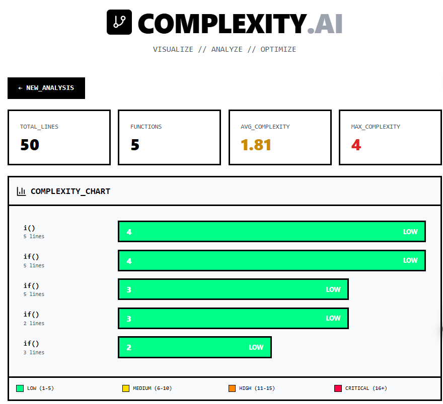

# Code Complexity Visualizer

> Analyze cyclomatic complexity and identify refactoring targets

 | [Video Demo](gif)

## What It Does
Paste JavaScript/TypeScript code → Get instant complexity analysis → Identify problem functions

## Why Complexity Matters
- Functions with complexity > 10 are 2x more likely to contain bugs
- Used by teams at Google, Microsoft, etc for code reviews
- Industry standard: keep complexity under 10

## Tech Stack
React, Custom Parser, Cyclomatic Complexity Algorithm

## Future Improvements
- [ ] Support more languages (Python, Java)
- [ ] GitHub integration
- [ ] CI/CD plugin# ComplexityAI
